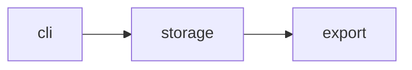
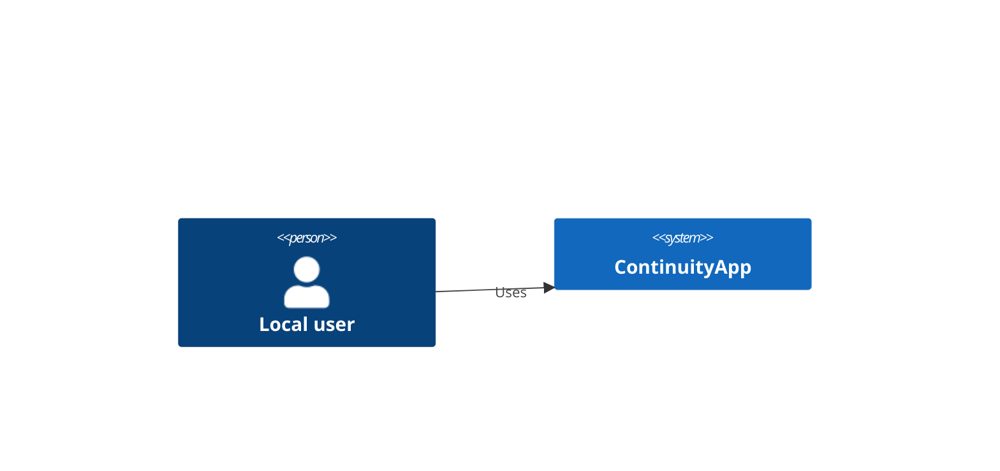

# Design — ContinuityApp

## 0. Introduction & Goals

### 0.1 Mission

A deterministic todo CLI proving the pi-velpari continuity chain.

### 0.2 Top 3-5 Quality Goals

| # | Quality Attribute | Goal | Source PRD row |
|---|---|---|---|
| 1 | Performance | sync under 2s | NFR-01 |
| 2 | Usability | add in under 3 clicks | NFR-02 |

### 0.3 Stakeholders

| Stakeholder | Concern | Viewpoint |
|---|---|---|
| local user | fast reliable CLI | Runtime |

### 0.4 Architecture Constraints

| Constraint | Source | Type |
|---|---|---|
| Linux arm64 | PRD §Constraints | platform |
| Node.js LTS | PRD §Dependencies | runtime |

## 1. Module Breakdown

| Module | Purpose | Source FRs | Maturity | Depends on |
|---|---|---|---|---|
| storage | persist todos | FR-01 | proposed | — |
| sync | cross-device sync | FR-02 | proposed | storage |
| export | CSV output | FR-03 | proposed | storage |

## 2. Data Model

| Entity | Fields | Constraints | Notes |
|---|---|---|---|
| Todo | id, title, done | id unique | JSON file rows |

## 3. Interface Contracts

- Function: addTodo(title) → id
  - Inputs: non-empty title
  - Outputs: todo id
  - Errors: EmptyTitle

## 4. Data Flow



## 5. Quality Attribute Scenarios

| NFR ID | Source | Stimulus | Environment | Artifact | Response | Response measure | Approach | Source PRD row |
|---|---|---|---|---|---|---|---|---|
| NFR-01 | user | trigger sync | normal | sync | sync completes | under 2 seconds | cache | NFR-01 |
| NFR-02 | user | add todo | normal | cli | todo created | under 3 clicks | progress-indicator | NFR-02 |

## Architecture Decisions

- ADR-001: Use Layered | Status: accepted | Stage: design | Date: 2026-09-14T00:00:00.000Z

```yaml
{"id":"ADR-001","title":"Use Layered","status":"accepted","stage":"design","date":"2026-09-14T00:00:00.000Z","runId":"run-continuity","context":"todo CLI needs simple layering","options":[{"id":"layered","label":"Layered","pros":"simple","cons":"scaling"},{"id":"modular-monolith","label":"Modular Monolith","pros":"decomposed","cons":"more files"}],"decision":"layered","rationale":"fixture style choice","consequences":"none for the fixture","reconsiderTriggers":["scale"]}
```

## 9. Context View

### 9.1 Users

| Persona | Access | Primary goal |
|---|---|---|
| local user | terminal | manage todos |

### 9.2 External Systems

| External system | Purpose | Protocol | Auth | Data direction | Owner | SLA |
|---|---|---|---|---|---|---|
| file system | storage | n/a | n/a | local | user | n/a |

### 9.3 Trust Boundaries

| Boundary | From | To | Why the boundary exists |
|---|---|---|---|
| process edge | cli | storage | validated input only |

### 9.4 Cross-boundary Data Flows

| Data | From | To | Rate | Sensitive fields | Encryption |
|---|---|---|---|---|---|
| todos | cli | storage | on change | none | n/a |

## 10. Deployment View

### 10.1 Container → Host Mapping

| Container | Host | Region / Zone | Scaling limits |
|---|---|---|---|
| cli | laptop | local | 1 |

### 10.2 Network Topology

| Network | CIDR / Endpoint | Purpose | Trust level |
|---|---|---|---|
| none | n/a | offline CLI | trusted |

### 10.3 Scaling Boundaries

| Container | Limit | Source |
|---|---|---|
| cli | 1 process | NFR-01 cache tactic |

## 11. Crosscutting Concepts

| Crosscutting concern | Decision |
|---|---|
| Persistence | JSON file |
| Logging | stderr levels |

## 12. Risks & Tech Debt

| Risk / Tech debt | Impact | Mitigation | Owner | Status |
|---|---|---|---|---|
| corrupt storage | data loss | validate on load | fixture | known |

## 13. Glossary

| Term | Definition | Source |
|---|---|---|
| Todo | task record | PRD Glossary |

## 14. Diagrams (C4)

### 14.1 System Context (C4 Level 1)



### 14.2 Container view (C4 Level 2)

```mermaid
C4Container
  Person(user, "Local user")
  System_Boundary(c1, "ContinuityApp") { Container(app, "CLI", "Node") }
  Rel(user, app, "Uses")
```

### 14.3 Component view (C4 Level 3)

```mermaid
C4Component
  Container_Boundary(app, "CLI") { Component(core, "Core", "Node") }
```

## Change Log

- 2026-09-28: continuity fixture design.
