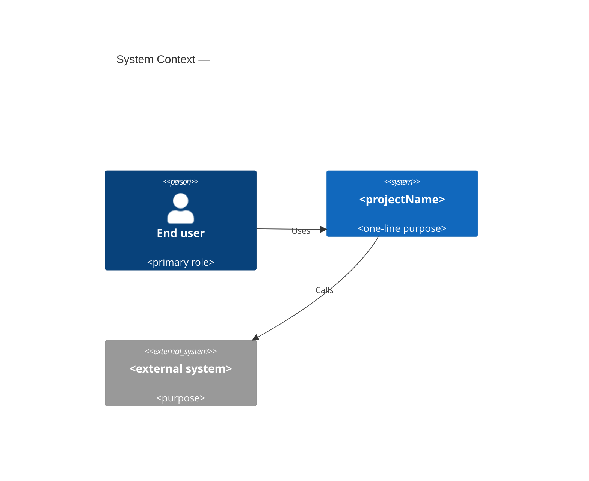
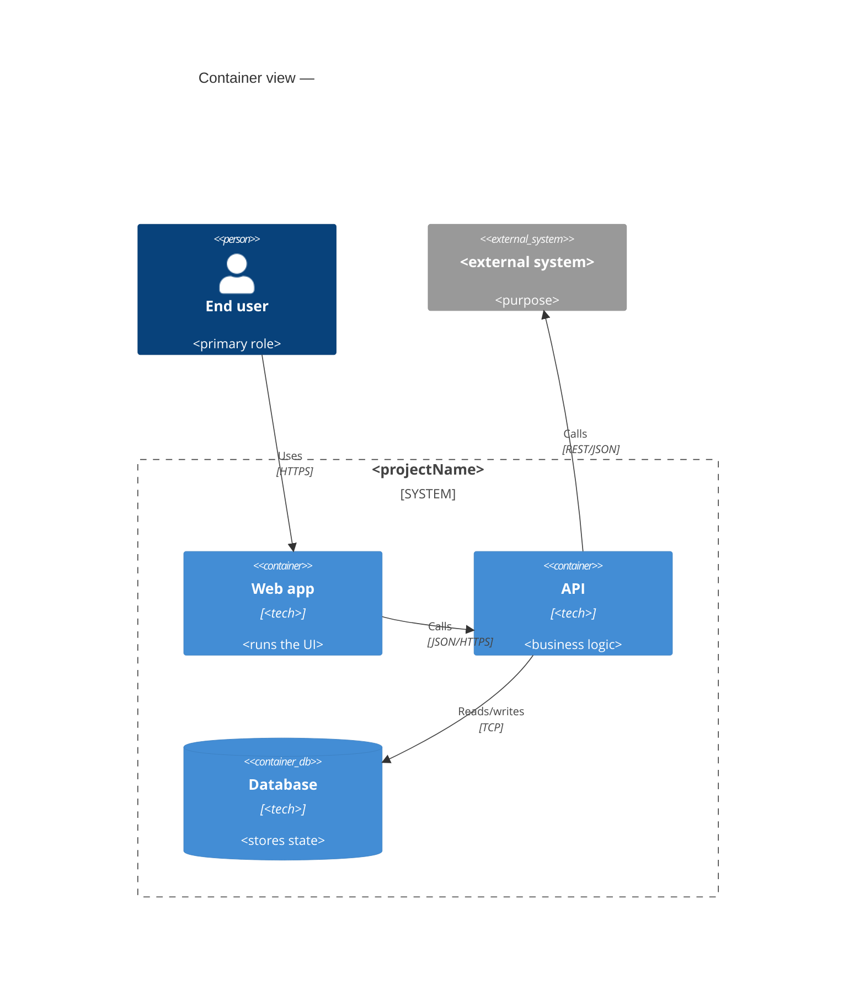
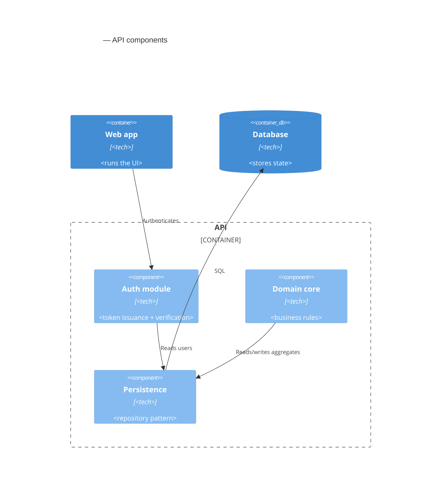

# Design Stage

Produce the high-level design: module breakdown, data model, interface
contracts, data flow, error handling, and non-functional considerations.
The handler has already validated the gate (feasibility study must exist)
and embedded its path in the prompt. Your job is to spawn 4 subagents in
parallel, read their reports, and write the working-copy design.

> **Phase 2 update (plan §Phase 2):** Before this prompt runs, the handler
> has already executed a sub-life cycle prelude — read the project
> context, shown the developer a one-paragraph summary, and asked the
> developer to confirm. The doctor gate refuses to publish unless
> `state.json:archSubCycle.developerConfirmed` is `true`. If the
> developer did not confirm, the handler has already exited and this
> prompt never runs.

## Goal

By the end of this stage, `<workingCopy>` (`design_<projectName>.md`)
has every section filled, the user has approved the preview, and the
`velpari_stage_publish` tool can publish the artifact to
`Doc/design_<projectName>.md` without surprises. `/velpari-architecture-generator-approve` remains as the manual fallback.

## Sequence

```
sub-life cycle prelude (already executed by handler):
  1. loadArchContext() reads PRD, RTM, feasibility, profiles
  2. confirmWithDeveloper() shows summary + asks Proceed / Adjust / Profile
  3. archSubCycle state persisted with developerConfirmed flag
  4. (handler exits if not confirmed — this prompt never runs)
        │
        ▼
feasibility study (already in prompt as inputArtifact)
        │
        ▼
spawn 4 source subagents in parallel via subagent() tool:
  ├─ design-module-decomposer     → <scoutReportDir>/design-module-decomposer-report.json
  ├─ design-contract-definer      → <scoutReportDir>/design-contract-definer-report.json
  ├─ design-data-flow-mapper       → <scoutReportDir>/design-data-flow-mapper-report.json
  └─ design-error-definer          → <scoutReportDir>/design-error-definer-report.json
        │
        ▼ (wait for all 4 — see Synchronization rules below)
spawn design-conflict-detector (5th conditional scout, Phase 4)
        ├─ reads the 4 base reports + any overlay scouts
        └─ → <scoutReportDir>/design-conflict-detector-report.json
        │
        ▼
read 5 reports (4 base + 1 conflict detector)
        │
        ▼
spawn design-reviewer (Plan D — adversarial critic, tier + overlay gated)
        ├─ reads all source reports + the merged working copy
        ├─ emits a structured verdict JSON (see skills/agents/design-reviewer.md)
        └─ → <scoutReportDir>/design-reviewer-report.json
        ├─ reads the 4 base reports + any overlay scouts
        └─ → <scoutReportDir>/design-conflict-detector-report.json
        │
        ▼
read 5 reports (4 base + 1 conflict detector)
        │
        ▼ (if conflicts.severity === "error" or "warn")
for each conflict:
  - AskUserQuestion (Pick A / Pick B / Composite / Re-spawn)
  - record decision as ADR (use core/adr.ts:renderADR)
        │
        ▼
build design markdown from the 4 reports + captured ADRs
        │
        ▼
write working copy <workingCopy>
        │
        ▼
update archSubCycle.workingCopyPath in state.json
        │
        ▼
AskUserQuestion "Publish preview?"
        │
        ▼ (yes)
call velpari_stage_publish tool (no parameters)
```

## Subagent conventions

The 4 scouts live in `.pi/agents/{design-module-decomposer,design-contract-definer,design-data-flow-mapper,design-error-definer}.md`.
They are real subagents — they run in **visible multiplexer panes** you can
monitor. Use the `subagent` tool (provided by `pi-interactive-subagents`):

- **Agent parameter** — Every `subagent()` call MUST include `agent:` with one
  of: `design-module-decomposer`, `design-contract-definer`,
  `design-data-flow-mapper`, `design-error-definer`.
- **Session mode** — All 4 declare `session-mode: standalone`; do NOT pass
  `fork: true`.
- **Auto-exit** — All 4 declare `auto-exit: true`; the pane closes
  automatically after the agent finishes its turn.
- **Working directory** — Pass `cwd: <runDir>` so scouts can use relative paths.
- **Explicit output path** — Each scout's `task:` MUST include the exact
  artifact path it must write.
- **Task content** — Pass the feasibility-study path (`<inputArtifact>`) and
  the scout's own report path. The contract, data-flow, and error scouts
  also need the cross-references to the other scouts' reports.
- **No turn cap** — The `subagent` tool has NO turn-cap parameter. Use
  `subagent_interrupt` (Pi-backed only) if a scout hangs.
- **No isolation parameter** — The `subagent` tool has no pane-isolation or
  worktree parameter; never pass one.

**What the `subagent` tool does NOT accept:** any turn-cap parameter,
pane-isolation, worktree, alternate-prompt fields, or `systemPrompt`-style
overrides. Use `task` for the prompt, `cwd` for working directory, and
`agent` for the agent definition. If a scout hangs, use `subagent_interrupt`.

**caller_ping (child-to-parent help request):** A scout that gets stuck
mid-task can call `caller_ping({ message: "..." })`. The child exits and
the parent receives a steer notification. Use this for genuine
clarification needs, not as a normal flow.

## Synchronization and checkpoint rules

`pi-interactive-subagents` runs each subagent asynchronously in its own
multiplexer pane.

1. **Use unique names** for every parallel subagent (e.g. `design-decomposer`,
   `design-contracts`, `design-dataflow`, `design-errors`).
2. **Wait for all completion notifications before proceeding.**
3. **If an expected file is missing, check the live widget first.**
   - Agent still `starting`/`active`/`waiting` → wait.
   - Agent `stalled` or failure received → interrupt and wait.
4. **Verify every artifact** with `test -s <artifactPath>` (bash).
5. **Never write a scout's artifact yourself.**
6. **Strict checkpoints:**
   - `contract-definer`, `data-flow-mapper`, `error-definer` need
     `module-decomposer`'s report. Start them in parallel — they all read
     the input artifact. The data-flow and error scouts also benefit from
     the contract scout's report (in the second batch if needed).
   - Write the working copy only after all 4 reports exist.

**Live widget status reference:**

| State | Meaning |
|---|---|
| `starting` | Launched but no valid child snapshot yet |
| `active` | Doing observed runtime work |
| `waiting` | Finished a turn, open for more input |
| `stalled` | Parent lost trust in the run's health |
| `running` | Fallback for backends without child snapshots |

## Merge into final design

After all 4 scouts complete:

1. Read the 4 reports.
2. Build the design markdown (see "Output Format" below).
3. Write to `<workingCopy>`.

## Output Format

Write the working copy as `design_<projectName>.md` at `<workingCopy>`:

```markdown
---
artifact: design
project: <projectName>
version: 1.0.0
status: draft
stage: designing
run: <runId>
created: <ISO timestamp>
updated: <ISO timestamp>
---

# High-Level Design — <projectName>

> **Quick Reference** — One-page summary for skimmers. Top 3 quality
> goals, top 3 risks, chosen style, primary domain context, top 3
> modules. Pulled from this design's own sections; never invented.
>
> | Question | Answer | Source |
> |---|---|---|
> | Mission | <one-line from §0.1> | §0.1 |
> | Chosen style | <style id from ADR-001> | §8 ADR-001 |
> | Top 3 quality goals | <names, response-measures> | §0.2 |
> | Top 3 risks | <risks> | §12 |
> | Top 3 modules | <modules + purpose> | §1 |
> | Domain context | <one-line> | §9 Context View |

## 0. Introduction & Goals

(arc42 §1 + ISO/IEC/IEEE 42010 stakeholder correspondence)

### 0.1 Mission

One sentence describing the project's purpose. Lifted from
`state.json:mission`. Example: "Deliver a SaaS todo app for individual
freelancers."

### 0.2 Top 3–5 Quality Goals

Lift the **top 3–5 quality goals** from the source PRD (§4 Quality
Requirements / §5 Non-Functional Requirements). Order by priority.
Each row carries the QA name and the response-measure that defines
"done enough." The full SEI 6-part scenarios live in §5.

| # | Quality Attribute | Goal (response-measure summary) | Source PRD row |
|---|---|---|---|
| 1 | <name> | <one-line measurable goal> | NFR-NN |
| 2 | <name> | <one-line measurable goal> | NFR-NN |
| 3 | <name> | <one-line measurable goal> | NFR-NN |
| 4 | <name> | <one-line measurable goal> | NFR-NN |
| 5 | <name> | <one-line measurable goal> | NFR-NN |

Reject any row whose goal is not measurable. Vague rows like "fast" or
"secure" are not allowed; rewrite them with a numeric response-measure
(e.g., "p95 latency < 200 ms at 10k concurrent users").

### 0.3 Stakeholders

Each stakeholder + their top concern. The concerns here drive the
viewpoints in §3 (Context) and the views in §6 (Runtime).

| Stakeholder | Concern | Viewpoint they care about |
|---|---|---|
| <role> | <one-line> | Context / Deployment / Runtime |
| <role> | <one-line> | <view> |

Common stakeholders: end user, ops/SRE, security/audit, support,
product owner, developer, regulator.

### 0.4 Architecture Constraints

(arc42 §2 — hard limits that remove architectural options before any
choice is made.)

The constraints come from PRD §13 + feasibility study + standards
overlay. Each constraint lists its source so reviewers can validate
it. Constraints differ from goals: a goal is what the system should
*achieve*, a constraint is what the system *cannot violate*.

| Constraint | Source | Type |
|---|---|---|
| <e.g., must run on Linux arm64> | <PRD §13.1 / feasibility §3 / standards overlay> | platform / regulatory / budget / org / vendor |
| <e.g., must encrypt data at rest using AES-256> | <...> | <type> |
| <e.g., deploy budget ≤ USD 200 / month> | <...> | <type> |

Reject any "soft constraint" — if it can be relaxed, it belongs in
§5 as a Quality Attribute Scenario, not here.

## 1. Module Breakdown

| Module | Purpose | Source FRs | Maturity | Depends on |
|---|---|---|---|---|
| <name> | <purpose> | FR-NN, FR-MM | proposed / accepted / experimental | M-2, M-5 |
| <name> | <purpose> | FR-NN, FR-MM | proposed / accepted / experimental | — |

**Maturity values:**
- `proposed` — design-time only; not yet built.
- `accepted` — built and reviewed; considered final.
- `experimental` — built, in production, but still subject to change.

**Depends on:** comma-separated list of other module names in the
same §1 table. A row with `Depends on: M-2, M-5` means the module's
contracts read or write data owned by M-2 and M-5. Lists enable
downstream traceability (each module's tests can identify fixture
modules by name). A row may not list a module absent from this
section.
|---|---|---|
| <name> | <purpose> | FR-NN, FR-MM |
| ... | | |

## 2. Data Model

| Entity | Fields | Constraints | Notes |
|---|---|---|---|
| <name> | <field list> | <constraints> | <notes> |
| ... | | | |

## 3. Interface Contracts

For each module, list public functions/classes with:
- Function name + signature
- Inputs + outputs + types
- Preconditions + postconditions
- Error cases

## 4. Data Flow

(Per Rozanski & Woods — runtime/communication view.)

ASCII or Mermaid diagram showing **end-to-end runtime data flow**:
- User inputs → module boundaries
- Storage writes/reads
- External API calls
- Error propagation paths

## 5. Quality Attribute Scenarios

(SEI 6-part scenario form per Bass / Clements / Kazman, *Software Architecture in Practice*)

One row per non-functional requirement from the source PRD. Every row
**must** use the 6-part form. The `Approach` cell names one tactic from
the SEI tactics catalog (see `pi-extension/src/core/tactic-catalog.ts`
and Phase 5). Vague cells like "fast", "scalable", or "encrypted" are
not accepted.

| NFR ID | Source | Stimulus | Environment | Artifact | Response | Response measure | Approach (SEI tactic) | Source PRD row |
|---|---|---|---|---|---|---|---|---|
| NFR-1 | <who/what> | <trigger> | <normal/peak/...> | <module> | <what the system does> | <numeric or measurable target> | <tactic name from catalog> | NFR-NN |
| NFR-2 | ... | ... | ... | ... | ... | ... | ... | ... |

Definitions of the 6 parts (do not skip or reorder):

| Part | Meaning | Example |
|---|---|---|
| Source | Who/what creates the stimulus | "1,000 concurrent users" |
| Stimulus | The trigger | "Click 'Buy'" |
| Environment | Conditions under which it happens | "Normal load" |
| Artifact | The subsystem that responds | "checkout-service" |
| Response | What the system does | "Order is persisted" |
| Response measure | How success is measured | "Within 2 s, 99 % of the time" |

Rules:

1. Every row carries an RFC 2119 keyword (`shall` / `should` / `may`).
2. Every `Approach` cell names a tactic from the SEI tactics catalog
   (Phase 5). Unknown tactic = warning + block by default.
3. Every `Response measure` is numeric and bounded. Free-form text is
   not accepted.
4. Each row traces to a specific PRD NFR row.
5. Doctor's publish gate hard-blocks publishing when §5 is missing
   any required field or contains an unknown tactic name.

## 6. Error Handling

<summary from design-error-definer report>

## 7. Traceability

Every module in §1 traces back to at least one FR-N from the source PRD.

## 8. Architecture Decisions (Phase 4)

**MANDATORY: every design carries at least ADR-001.**

ADR-001 is the **architectural style choice** — the most consequential
decision in the design. The doctor gate rejects any design without
ADR-001 in `accepted` status with at least 2 options compared. This
is the audit trail for "why this style, not another."

Every design conflict surfaced by the design-conflict-detector scout
is recorded here as additional ADRs (ADR-002, ADR-003, ...). The
shape comes from `core/adr.ts:renderADR`:

```yaml
- ADR-001: <title> | Status: accepted | Stage: design | Date: <ISO>
```yaml
{
  "id": "ADR-001",
  "title": "<short title — the style, e.g., 'Modular Monolith' or 'Layered' >",
  "status": "accepted",
  "stage": "design",
  "date": "<ISO>",
  "runId": "<runId>",
  "context": "<what triggered this decision; cite the §5 QA scenarios it serves>",
  "options": [
    {"id": "A", "label": "<Modular Monolith>", "pros": "<...>", "cons": "<...>", "score": "<n>/10"},
    {"id": "B", "label": "<Microservices>", "pros": "<...>", "cons": "<...>", "score": "<n>/10"}
  ],
  "decision": "<A or B — the chosen option id>",
  "rationale": "<why this option over the others; cite QA scenarios>",
  "consequences": "<what becomes easier / harder>",
  "reconsiderTriggers": ["<condition that would reverse this>"]
}
```

If no conflicts were surfaced, the §8 section can still be present
with just ADR-001 (style choice) and ADR-000 (no conflicts) — the
doctor gate **requires** ADR-001 in every published design.

```

## 9. Context View

(Rozanski & Woods Context viewpoint; ISO/IEC/IEEE 42010 correspondence
view; C4 Level 1.)

This view documents the system boundary — what is inside the system vs
what is outside, and how the system exchanges data with the outside
world. The 5th scout (`design-context-mapper`) extracts the data from
the PRD + feasibility + standards overlay; the parent LLM renders it
here.

### 9.1 Users

Personas (lifted from PRD §3 — System Actors) who directly interact
with the system.

| Persona | Access | Primary goal |
|---|---|---|
| <name> | <web / mobile / API / CLI> | <one-line> |

### 9.2 External Systems

Every system, service, queue, or datastore the system talks to across
its boundary. **Every** external system in this table must have an
integration note (auth method, protocol, SLA, owner). Unknown external
systems → warning at publish time.

| External system | Purpose | Protocol | Auth | Data direction | Owner | SLA |
|---|---|---|---|---|---|---|
| <name> | <one-line> | <REST/gRPC/queue/event> | <OAuth/mTLS/API key/...> | <in/out/both> | <team> | <% / ms> |

### 9.3 Trust Boundaries

Every place the security context changes (auth check, network
boundary, zone boundary, data classification boundary). Trust
boundaries are critical for security audits and for choosing
encryption / authentication tactics.

| Boundary | From | To | Why the boundary exists |
|---|---|---|---|
| <name> | <context A> | <context B> | <e.g., user zone → server zone; untrusted → trusted> |

### 9.4 Cross-boundary Data Flows

The data flows that **cross** a trust boundary. Tied to the same
flows documented inside the system (see §5 — Data Flow in arc42 §6,
renamed in our template to §4 Data Flow). Internal-only flows live in
§4.

| Data | From | To | Rate | Sensitive fields | Encryption |
|---|---|---|---|---|---|

## 10. Deployment View

(Rozanski & Woods Deployment viewpoint; ISO/IEC/IEEE 42010 deployment
view.)

This view documents **where** the system runs. The 6th scout
(`design-deployment-mapper`) extracts the data from the framework
config + feasibility + standards overlay; the parent LLM renders it
here.

### 10.1 Container → Host Mapping

One row per container (process). Hosts are physical machines,
virtual machines, k8s pods, or serverless execution environments.

| Container | Host | Region / Zone | Scaling limits |
|---|---|---|---|
| <container name> | <host: e.g., k8s pod / vm / serverless function> | <region> | <min–max replicas> |

### 10.2 Network Topology

Public endpoints, private subnets, peering, CDNs, edge caches.

| Network | CIDR / Endpoint | Purpose | Trust level |
|---|---|---|---|

### 10.3 Scaling Boundaries

Limits that determine when an attribute (e.g., availability,
scalability) is satisfied.

| Container | Limit | Source |
|---|---|---|
| <container> | <numeric limit + unit> | <tactic in §5 / feasibility §9> |

Rejected phrases: "unlimited", "as needed", "scalable" — every row
must name a number.

## 11. Crosscutting Concepts

(arc42 §8 — concepts that span multiple modules.)

These are the rules and conventions the system applies **uniformly**
across multiple modules. They get omitted from individual module
descriptions because they appear everywhere. The Crosscutting extractor
scout (`design-crosscutting-extractor`) mines these from the framework
config + standards overlay + feasibility study.

For each topic, name the **concrete** decision the system makes (not
"we use logging everywhere" — name the library, the format, the
retention policy).

| Crosscutting concern | Decision |
|---|---|
| **Persistence** | <how the system stores state; primary datastore(s); ORM/ODM; migration policy> |
| **Transaction handling** | <unit of work boundaries; compensating action policy> |
| **Logging** | <library + format (JSON / structured); min level; correlation id strategy> |
| **Observability** | <metrics + tracing + alerting stack; SLOs> |
| **Error handling** | <exception taxonomy; HTTP error mapping; retry policy> |
| **Security — authn** | <algorithm + token strategy; session length; refresh policy> |
| **Security — authz** | <RBAC / ABAC / policy engine; default-deny vs default-allow> |
| **Security — input** | <validation library; sanitisation strategy; injection tests> |
| **Communication** | <REST / gRPC / messaging; protocol; serialization (JSON / Protobuf)> |
| **Configuration** | <format (env / file / vault); reload policy> |
| **Deployment** | <CI/CD tooling; deploy strategy (blue/green / canary / rolling)> |
| **Testing** | <unit / integration / e2e frameworks; mock strategy; coverage threshold> |

Reject any row whose "Decision" cell is empty. The decision is
what makes this section useful.

## 12. Risks & Tech Debt

(arc42 §11.)

Every architecture ages. Future maintainers must see what was
knowingly traded off. Listed by impact.

| Risk / Tech debt | Impact | Mitigation | Owner | Status |
|---|---|---|---|---|
| <name> | <what goes wrong if this fires> | <how we plan to mitigate> | <team / person> | <known / mitigated / accepted> |

Rejected phrases:
- "No risks" (every architecture has at least one risk; name it).
- Risk whose `Impact` cell is vague (must be specific).
- Risk without an `Owner` (orphans cannot be re-assessed).

## 13. Glossary

(arc42 §12 — Ubiquitous Language.)

Domain terms used through the project. Each row cites the source so
reviewers can verify the term is from the project, not invented.

| Term | Definition | Source |
|---|---|---|
| <term> | <one-line definition> | <PRD §X.Y / feasibility §Z> |

Rejected phrases:
- Terms that are not actually used in the design doc.
- Terms defined with no source.
- Definitions longer than one sentence.

## 14. Diagrams (C4)

(C4 model — Simon Brown; https://c4model.com.)

Every design carries three Mermaid C4 diagrams. The Mermaid blocks
are written by the data-flow-mapper scout; the parent LLM verifies
they parse and that each is non-empty before publishing.

### 14.1 System Context (C4 Level 1)

Who uses the system and what external systems it talks to. The most
executive-summarizable view. One diagram.



### 14.2 Container view (C4 Level 2)

The applications, datastores, queues that make up the system. One
diagram.



### 14.3 Component view (C4 Level 3)

For each non-trivial container, one diagram zooming into its
modules. At least one component diagram; more for the largest
container.



Reject any section whose Mermaid block does not start with
`C4Context`, `C4Container`, or `C4Component`. The doctor gate validates
all three diagrams parse before publishing.

## Zero-Hallucination Rule (FR-22)

Every module, data entity, and interface must trace back to a statement in
the source feasibility study AND the PRD. If neither mentions it, do not
invent it.

## Project-Name Substitution (FR-67, NFR-15)

Use `projectName` from the input artifact in all output paths. Never
hardcode "Pi-Velpari" in any file path.

## Update Mode

When the prompt carries an `## Update Mode` block, this run REVISES the
published design in place — never rewrite it from scratch. Explicitly
name the upstream changes (from the revised feasibility study and PRD)
that triggered this revision.

Revision rules:

1. **Keep module names.** Existing modules in §1 keep their names and
   their Source FRs. New modules are appended as new rows — never rename
   or renumber existing modules.
2. **Deprecate, don't delete.** A module, entity, or contract that is
   removed stays in the document marked `deprecated` with a reason.
   Never delete it.
3. **Version bump.** Minor (x.Y.0) for additions only. Major (X.0.0)
   when anything is deprecated.
4. **Change Log entry required.** The `velpari_stage_publish` tool
   (same gate chain as `/velpari-architecture-generator-approve`) blocks publishing
   without a new Change Log entry.

The 4 scouts still run fresh — never reuse old scout reports.

## Publish (auto on working-copy ready)

When the working copy is at `<workingCopy>` (verify with `test -s <workingCopy>`), call the `velpari_stage_publish` tool (no parameters). It runs the publish gate (revision + arch-sub-cycle gate + ADR gate + design-readiness gate + post-publish doctor audit), writes the published copy to `Doc/`, and advances the stage. If the tool reports gate/doctor errors, fix the working copy and call it again.

Manual fallback (when the LLM-driven publish is unavailable): `/velpari-architecture-generator-approve` runs the same gate chain from the terminal.

## Hard rules

- **No in-process scouts.** Use the `subagent()` tool only.
- **Verify every artifact.** `test -s <path>` after each completion.
- **Never write a scout's artifact yourself.** Fix the spawn and relaunch.
- **Do NOT mutate `state.json.stage`.** The handler already advanced to
  `designing` via `createRun()`. The next state transition (`designed`)
  happens in the `velpari_stage_publish` tool (which same gate chain as `/velpari-architecture-generator-approve`). You only write the working copy
  artifact.
- **Read first, confirm, write.** The handler already loaded context and
  asked the developer to confirm. If you reach this prompt without an
  `archSubCycle.developerConfirmed: true` entry in state.json, refuse to
  proceed and tell the developer to re-run `/velpari-architecture-generator`
  in interactive mode.
- **Final message ≤ 10 lines.** When done, your reply must include only the
  outcome and the artifact path. Never paste the design content.

## Known issue: zellij `close-pane` bug

[Issue #19](https://github.com/HazAT/pi-interactive-subagents/issues/19) in
`pi-interactive-subagents` (open as of 2026-09-04): the zellij backend's
`close-pane` step can close the parent session instead of the subagent
pane. Workaround: do NOT manually focus a subagent pane during the design
stage. cmux, tmux, and wezterm backends target panes explicitly and are
not affected.